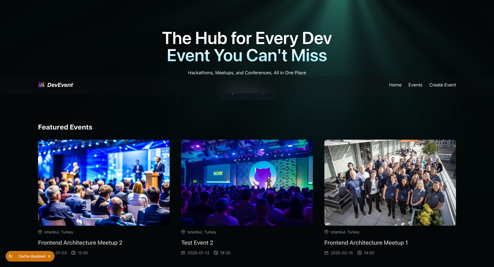
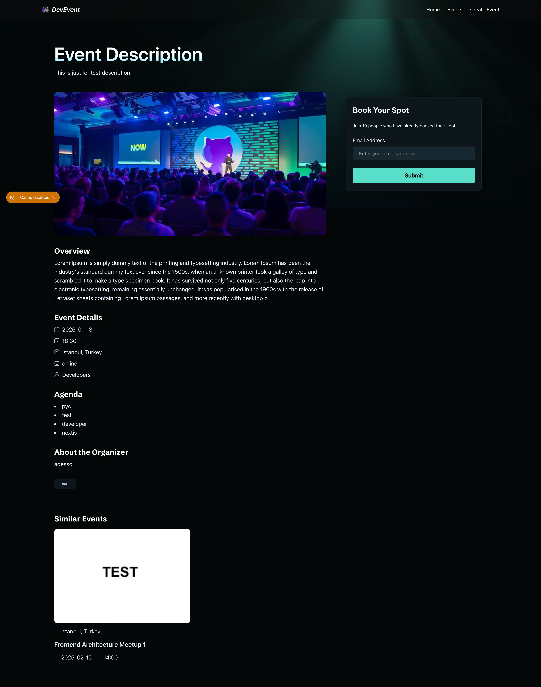
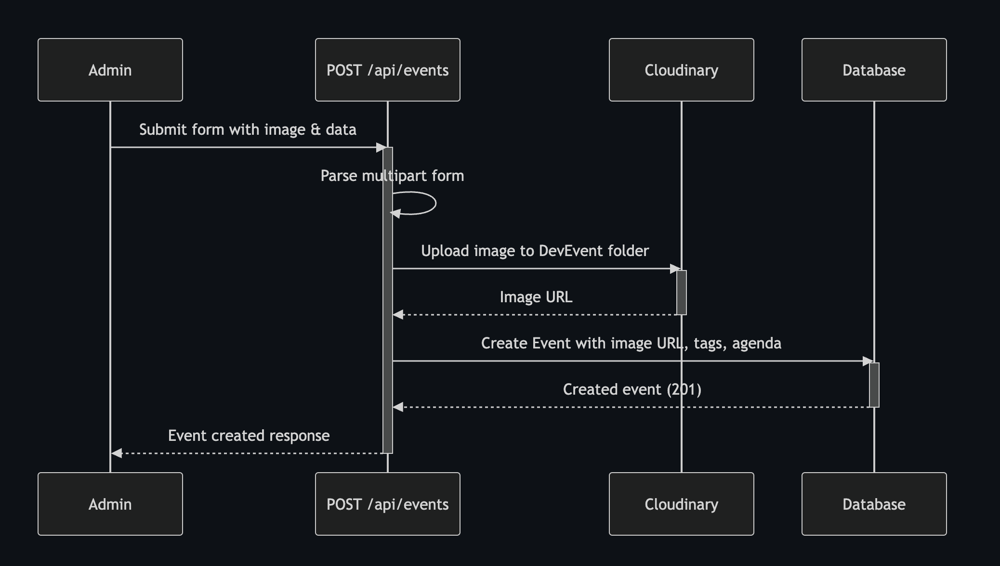
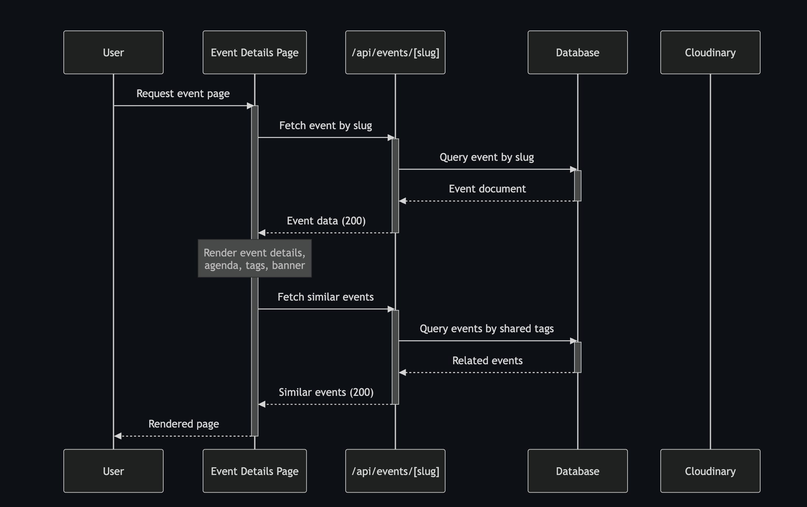
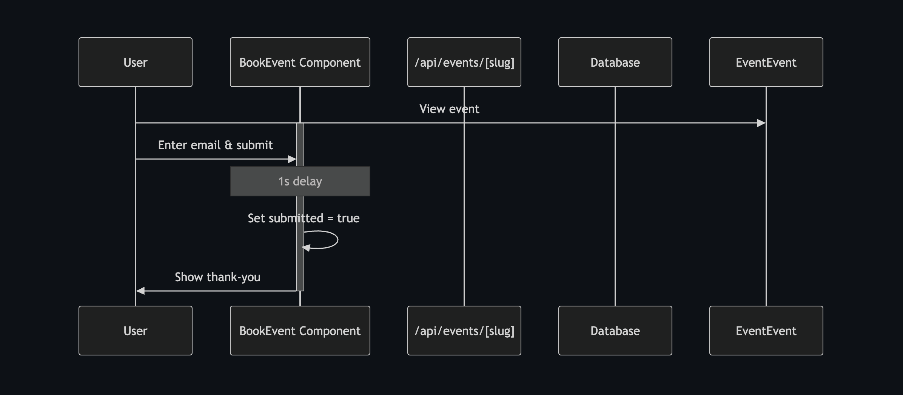

<div align="center">
  <br />
  <h1>Dev Event Platform</h1>
  <br />

  <a href="public/screenshoots/homePage.png">
    
  </a>

  <br />
  <br />

  <div>
     
     
    
    
    
    
  </div>

  <br />

  <p align="center">
    Modern event management platform built for "Individual Promotion System"
  </p>
</div>

## 📋 Table of Contents

1. ✨ [Introduction](#introduction)
2. ⚙️ [Tech Stack](#tech-stack)
3. 🔋 [Features](#features)
4. 📸 [Screenshots](#screenshots)
5. � [API Flow Architecture](#api-flow)
6. 🚀 [Quick Start](#quick-start)
7. 📁 [Project Structure](#project-structure)

## <a name="introduction">✨ Introduction</a>

Dev Event Platform is a comprehensive event management system designed for the **Individual Promotion System**. The platform enables seamless event creation, management, and registration with modern web technologies. Built with Next.js 16 and TypeScript, it provides a fast, type-safe, and scalable solution for organizing and tracking developer events.

## <a name="tech-stack">⚙️ Tech Stack</a>

- **[Next.js 16](https://nextjs.org/docs)** - React framework with enhanced server-side rendering (SSR), static site generation (SSG), incremental static regeneration (ISR), and revolutionary caching mechanisms. Features automatic code splitting, optimized data fetching, and built-in API routes for full-stack development

- **[TypeScript](https://www.typescriptlang.org/)** - Strongly typed JavaScript superset providing better code quality, IntelliSense, and error detection

- **[Tailwind CSS](https://tailwindcss.com/)** - Utility-first CSS framework for rapid UI development with responsive design and custom styling

- **[MongoDB](https://www.mongodb.com/products/platform/atlas-database)** - NoSQL database providing flexible schema design, scalability, and high performance

- **[Mongoose](https://mongoosejs.com/)** - MongoDB ODM (Object Data Modeling) library for schema validation, data modeling, and database operations

- **[Cloudinary](https://cloudinary.com/)** - Cloud-based media management platform for image upload, storage, optimization, and delivery

## <a name="features">🔋 Features</a>

👉 **Server-Side Rendering (SSR)**: Leveraging Next.js 16's enhanced SSR capabilities for improved SEO and initial page load performance

👉 **Advanced Caching Strategy**: Implementing Next.js 16's revolutionary caching approach with automatic cache invalidation and revalidation for optimal performance

👉 **Event Listing**: Dynamic home page displaying all upcoming and featured events with modern card-based design

👉 **Event Creation**: Complete event management system with form validation and image upload functionality

👉 **Event Details**: Comprehensive event pages showing full event information with registration capability

👉 **Event Registration**: User-friendly booking system allowing participants to register for events via email

👉 **Image Upload**: Cloudinary integration for seamless event image management and optimization

👉 **RESTful API**: Fully functional API routes for CRUD operations on events and bookings

👉 **Type Safety**: End-to-end TypeScript implementation ensuring code reliability and better developer experience

👉 **Database Validation**: Mongoose schemas with pre-save hooks and data validation for data integrity

👉 **Responsive Design**: Mobile-first design with Tailwind CSS ensuring optimal viewing on all devices

👉 **Modern UI/UX**: Glass morphism effects, smooth animations, and interactive light rays background

👉 **Slug Generation**: Automatic URL-friendly slug creation for SEO optimization

👉 **Form Validation**: Client and server-side validation for all user inputs

## <a name="screenshots">📸 Screenshots</a>

### Home Page

<div align="center">
  
  <p><em>Dynamic event listing with modern card-based design and light rays background effect</em></p>
</div>

### Event Details Page

<div align="center">
  
  <p><em>Comprehensive event information with registration form and similar events section</em></p>
</div>

### Create Event Page

<div align="center">
  
  <p><em>Modern event creation form with glass morphism effect and image upload functionality</em></p>
</div>

## <a name="api-flow">🔄 API Flow Architecture</a>

The application follows a modern API architecture with clear separation of concerns. Below are the comprehensive sequence diagrams showing the complete flow of different operations:

### Event Creation Flow

<div align="center">
  
  <p><em>Event creation process: form validation, Cloudinary image upload, slug generation, and MongoDB persistence</em></p>
</div>

**Key Steps:**

- Client-side form validation with image upload
- Cloudinary integration for image storage and optimization
- Automatic slug generation from event title
- Date and time normalization
- MongoDB persistence with schema validation
- Redirect to created event page

---

### Event Details Page Flow

<div align="center">
  
  <p><em>Event details page: fetching event data by slug, server-side rendering, and displaying comprehensive event information</em></p>
</div>

**Key Steps:**

- Dynamic route parameter handling ([slug])
- Server-side data fetching for optimal SEO
- Next.js 16 intelligent caching mechanism
- Event data retrieval from MongoDB
- Similar events suggestion algorithm
- Real-time booking availability

---

### Book Event Flow

<div align="center">
  
  <p><em>Event booking process: email validation, duplicate booking prevention, and confirmation</em></p>
</div>

**Key Steps:**

- Email format validation (client & server)
- Pre-save hook to verify event existence
- Unique constraint: one booking per email per event
- Automatic timestamp tracking (createdAt, updatedAt)
- Success confirmation display
- Database integrity checks

## <a name="quick-start">🚀 Quick Start</a>

Follow these steps to set up the project locally on your machine.

**Cloning the Repository**

```bash
git clone https://github.com/azatseyrek/nextjs-16-ssr.git
cd nextjs16
```

**Installation**

Install the project dependencies using npm:

```bash
npm install
```

**Set Up Environment Variables**

Create a new file named `.env` in the root of your project and add the following content:

```env
# MongoDB Connection
MONGODB_URI=your_mongodb_connection_string

# Cloudinary Configuration
NEXT_PUBLIC_CLOUDINARY_CLOUD_NAME=your_cloud_name
CLOUDINARY_API_KEY=your_api_key
CLOUDINARY_API_SECRET=your_api_secret

# Application URL
NEXT_PUBLIC_BASE_URL=http://localhost:3000
```

**Replace the placeholder values:**

- Get your MongoDB URI from [MongoDB Atlas](https://www.mongodb.com/cloud/atlas)
- Get your Cloudinary credentials from [Cloudinary Console](https://cloudinary.com/console)

**Running the Project**

```bash
npm run dev
```

Open [http://localhost:3000](http://localhost:3000) in your browser to view the project.

**Building for Production**

```bash
npm run build
npm start
```

## <a name="project-structure">📁 Project Structure</a>

```
nextjs16/
├── app/                      # Next.js 16 App Router
│   ├── api/                  # API routes
│   │   └── events/          # Event CRUD endpoints
│   ├── events/              # Event pages
│   │   ├── create/          # Event creation page
│   │   └── [slug]/          # Dynamic event detail pages
│   ├── layout.tsx           # Root layout
│   ├── page.tsx             # Home page
│   └── globals.css          # Global styles
├── components/              # React components
│   ├── BookEvent.tsx        # Event registration form
│   ├── CreateEventForm.tsx  # Event creation form
│   ├── EventCard.tsx        # Event card component
│   ├── EventDetails.tsx     # Event detail component
│   ├── LightRays.tsx        # Background animation
│   └── Navbar.tsx           # Navigation component
├── database/                # Database models
│   ├── booking.model.ts     # Booking schema
│   ├── event.model.ts       # Event schema
│   └── index.ts             # Database exports
├── lib/                     # Utility functions
│   ├── actions/             # Server actions
│   │   ├── booking.actions.ts
│   │   └── event.actions.ts
│   ├── constants.ts         # Constants
│   ├── mongodb.ts           # MongoDB connection
│   └── utils.ts             # Helper functions
└── public/                  # Static assets
    ├── icons/
    └── images/
```

## 🛠️ Development Notes

### Next.js 16 SSR & Caching

This project takes full advantage of Next.js 16's enhanced server-side rendering and caching capabilities:

**Server-Side Rendering (SSR)**

- Dynamic event pages are rendered on the server for optimal SEO and initial load performance
- Server Components by default, reducing JavaScript bundle size sent to the client
- Streaming HTML for faster Time to First Byte (TTFB)

**Advanced Caching Strategy**

- **Automatic Cache Management**: Next.js 16 automatically caches fetch requests and page renders
- **On-Demand Revalidation**: Event updates trigger automatic cache invalidation
- **Optimistic UI Updates**: Instant feedback while background revalidation occurs
- **Route Caching**: Static and dynamic routes are intelligently cached for performance

---

<div align="center">
  <p>Built for Individual Promotion System</p>
</div>
